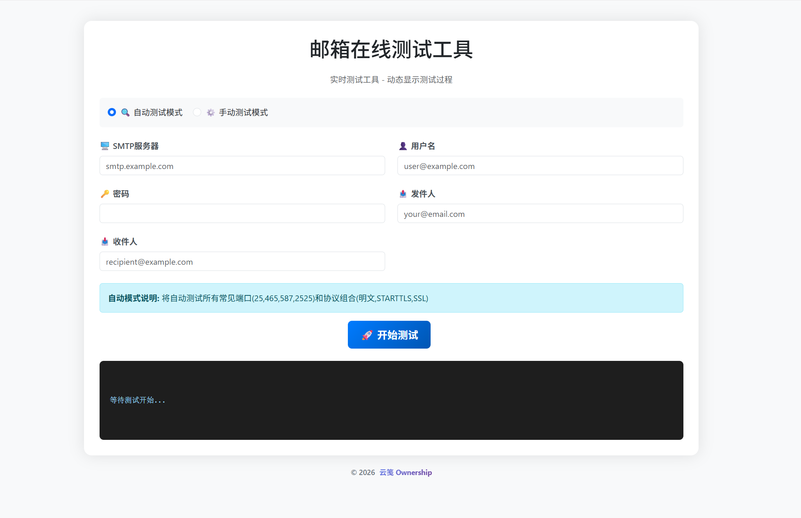
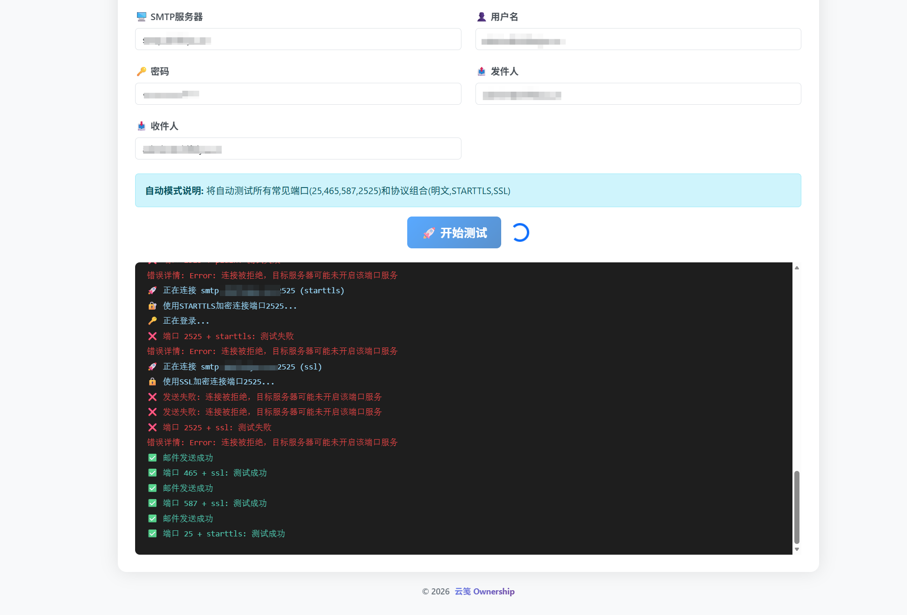
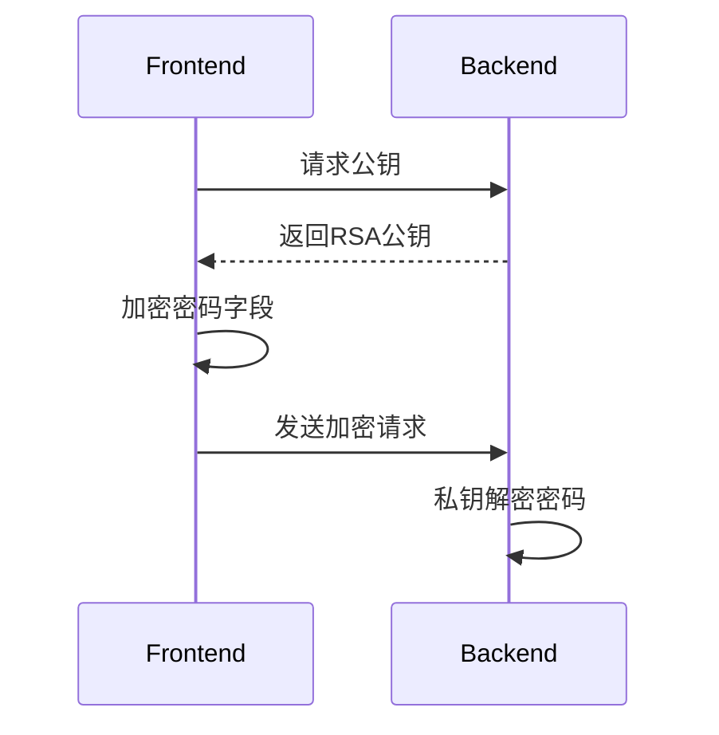

# SMTP邮件测试工具

一款安全的SMTP服务器测试工具，采用RSA加密传输密码。

## 核心安全特性

- 🔒 **所有环境强制密码加密**：前端RSA公钥加密，后端私钥解密
- 🔐 **零数据存储**：不保存任何用户数据，密码不在服务器留下痕迹
- 🔑 **隐私保护**：服务器归属者/开发者无法查看用户密码
- 🛡️ **临时密钥**：RSA私钥仅存内存，重启服务自动失效
- ⚠️ **明文拒绝**：任何环境发送明文密码都会返回错误

## 项目截图



 


## 快速开始

### 1. 使用Docker Compose安装

```yaml
# docker-compose.yml
# SMTP测试工具服务配置
services:
  mail-tester:
    # 使用当前目录的Dockerfile构建
    image: alioth1/mail-tester:latest
    container_name: mail-tester
    # 端口映射
    ports:
      - "5000:5000"  # 单一服务端口（HTTP + WebSocket）
    environment:
      # Flask运行环境配置
      
      # 版权信息配置
      COPYRIGHT_YEAR: "2026"  # 显示在页脚的版权年份
      COPYRIGHT_TEXT: "云笺 Ownership"  # 版权声明中的工具名称
      COPYRIGHT_LINK: "https://shifeiyu.cn"  # 版权文本点击跳转链接(留空则不跳转)
      
      # 页面标题配置
      PAGE_TITLE: "邮箱在线测试工具"  # 主标题文本
      PAGE_SUBTITLE: "实时测试工具 - 动态显示测试过程"  # 副标题文本
      
      # 图标配置
      FAVICON_URL: "https://shifeiyu.cn/upload/%E7%AB%99%E7%82%B9logo.png"  # 网站图标URL，示例: "https://example.com/favicon.ico" (留空则使用默认无图标)
    restart: unless-stopped
    network_mode: "bridge"
```

运行命令：
```bash
# 启动服务
docker compose up -d

# 查看日志
docker compose logs -f

# 访问应用
open http://localhost:5000
```

## 技术架构

### 加密流程


### 文件清单
| 文件/目录         | 作用                     |
|-------------------|--------------------------|
| `app.py`          | 后端主逻辑+加密处理       |
| `frontend_*.html` | 前端页面+加密逻辑         |
| `Dockerfile`      | 包含加密库依赖           |

## 开发者指南

### 测试加密功能
```bash
# 获取公钥
curl -s http://localhost:5000/api/config | jq .public_key

# 测试加密请求
curl -X POST http://localhost:5000/api/sendmail -H "Content-Type: application/json" -d '{
  "password": "ENCRYPTED:base64数据...", 
  "other_fields": "明文值"
}'
```

## 常见问题

Q: 如何确认密码是否加密传输？  
A: 浏览器开发者工具查看Network请求，password字段应为`ENCRYPTED:`开头

Q: 生产环境需要哪些额外安全措施？  
- 启用HTTPS
- 定期轮换RSA密钥对（重启服务自动生成新密钥）

## 💝 赞助作者

如果本项目对您有帮助，欢迎通过以下方式赞助：

**支付宝 / 微信**：转账时备注"随机图API赞助"

<!-- 支付方式图片 -->
<div style="display: flex; gap: 20px;">
  
  
</div>

## 项目地址

https://github.com/YunJian101/mail-tester

## 📄 许可证说明

本项目遵循 **GPL-3.0 许可证** 开源发布。

完整的许可证文本可访问 [GNU官方网站](https://www.gnu.org/licenses/gpl-3.0.html) 查看。

